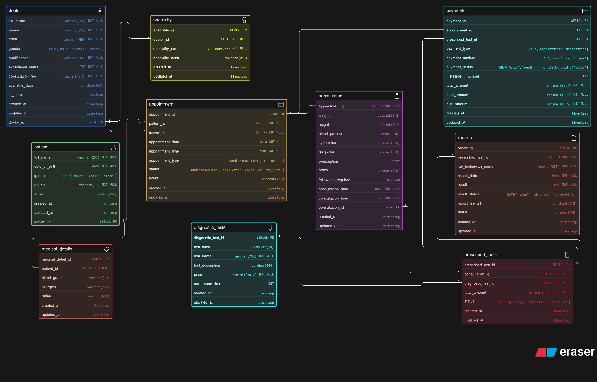

# Clinic Management System — ER Diagram

This repository contains the ER Diagram for a modern clinic management system.  
It models patients, doctors, appointments, medical details, consultations, diagnostic tests, prescribed tests,reports, and payments while reflecting real clinic workflows.  
The design focuses on clear relationships, proper PK–FK connections, and scalable database structure.

## ER Diagram

## Supporting Diagrams

